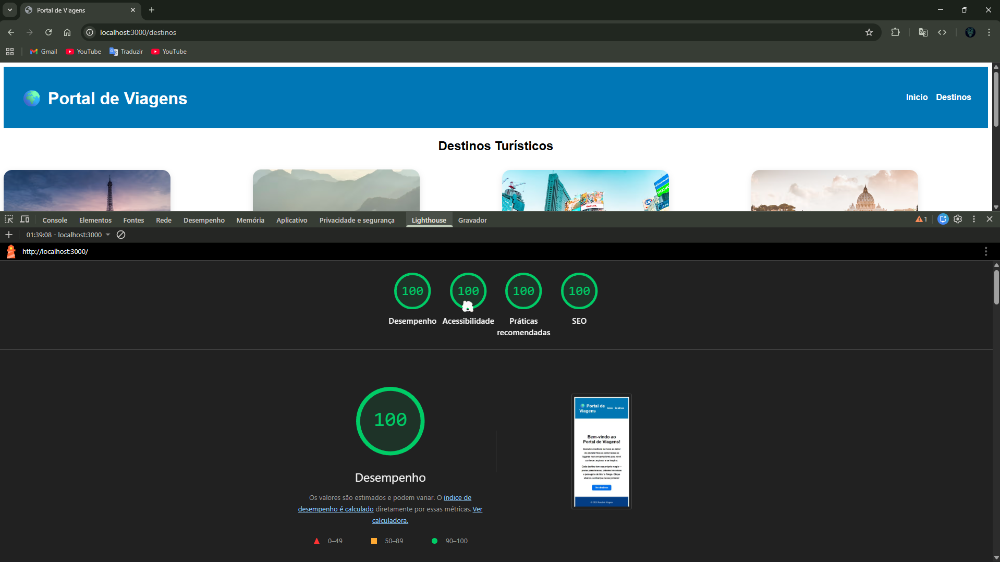

Este projeto é um portal de viagens desenvolvido em Next.js, que lista destinos turísticos e permite visualizar detalhes individuais de cada local.

### Relatório Inicial (Antes)

## Gargalos Identificados (Antes)

- Imagens grandes e não otimizadas, causando alto consumo de banda.
- LCP elevado devido ao carregamento de imagens sem priorização.
- JavaScript contribuindo para tempo de bloqueio da renderização.

---

### Relatório final (depois)

## Melhorias Aplicadas

- Substituição de  por next/image para otimização automática.
- Aplicação de lazy loading nas imagens.
- Remoção de imports e estilos não utilizados.
- Garantia de minificação de JS e CSS.

Comparação:

- Redução significativa do LCP
- Redução do TBT
- Melhor estabilidade visual

### Avisos remanescentes do Lighthouse

Após as otimizações, alguns alertas continuam sendo exibidos pelo Lighthouse, como:

- Renderizar solicitações de bloqueio
- Árvore de dependência da rede
- JavaScript legado (~12 KiB)

Esses avisos são inerentes ao funcionamento do framework Next.js, especialmente no uso de CSS Modules e do runtime interno da aplicação. Não representam gargalos reais de performance nem impactam negativamente a experiência do usuário, estando dentro dos limites aceitáveis para aplicações modernas.
